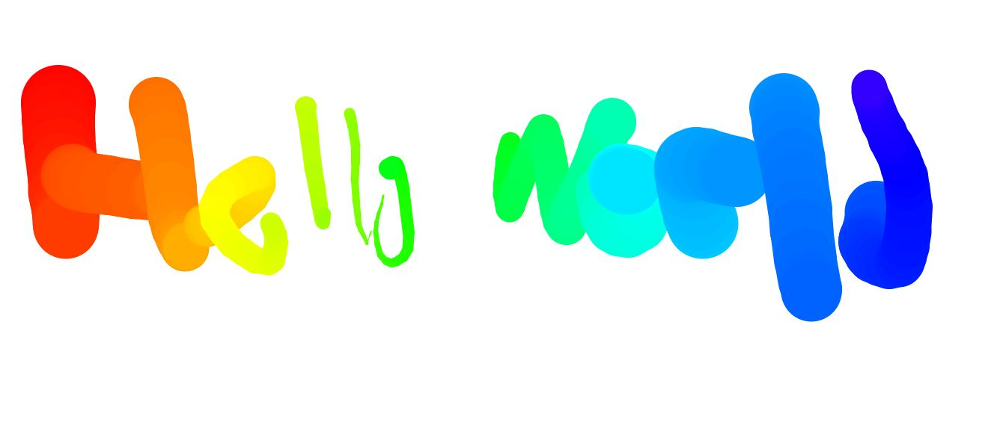

# HTMLCanvas

This is from day 8 of Wes Bos' JavaScript30 course.  I had to do it out of order because I was hunting and didn't have internet connection.  In this lesson we made a dynamic website that allows the user to colour on the page using a fun brush that constantly changes the hue and the size if the brush. It was made with JavaScript.  If you're interested you can find the course lessons <a href src="https://www.youtube.com/watch?v=8ZGAzJ0drl0&list=PLu8EoSxDXHP6CGK4YVJhL_VWetA865GOH&index=8">here.</a>

